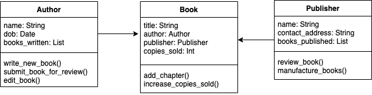

# Book class diagram



Class diagram for a ```Book``` class that is composed of an ```Author``` object and a ```Publisher``` object.

The ```Book``` has the attributes:
* title
* author
* publisher
* copies_sold

and methods:
* add_chapter
* increase_copies_sold